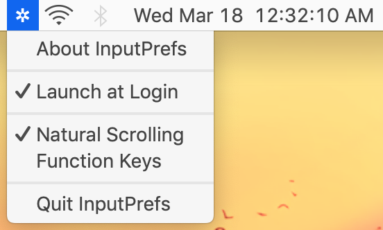

# InputPrefs
Quickly change function row and scrolling defaults on MacOS

  

### Download
[Download .dmg file under "Assets" in the latest release here](https://github.com/NafeeJ/InputPrefs/releases)

*IMPORTANT*: 
* If you get a warning that BatteryEstimate can't be opened due to an unidentified developer or Apple cannot check it for malicious software go to: "System Preferences" > "Security & Privacy" > "General" and make sure "Allow apps downloaded from:" is set to "App Store and identified developers". Then try again to open BatteryEstimate and under "System Preferences" > "Security & Privacy" > "General" click on "Open Anyway". You may have to do this for both opening the .dmg file and opening the app once it is in your Applications folder.
* For the app to work, it needs security permissions in "System Preferences" > "Security & Privacy" > "Privacy" and enable the checkmarks for the app in "Accessibility" and "Automation".
* If the app does not show in Privacy you have to click "Show Package Contents", open "Contents", open "MacOS", and double click on the "InputPrefs" executable. This is because 10.14 added privacy restrictions that requires permission for the app to modify system preferences but it may not actually *ask* the user for those permissions unless run as a Terminal executable.

### What is this
A MacOS menu bar app that contains buttons which run scripts that will:
* Switch the trackpad scrolling direction between "natural" and directional
* Switch the function row on the keyboard from between standard Apple functions and F1, F2... mode.

### References / Usages
* https://apple.stackexchange.com/questions/59178/toggle-use-all-f1-f2-as-standard-keys-via-script?rq=1
* https://joshspicer.com/applescript-mojave
* https://apple.stackexchange.com/questions/153243/changing-trackpad-scroll-direction-with-applescript-in-yosemite
* https://github.com/LinusU/node-appdmg
* https://github.com/sindresorhus/LaunchAtLogin
